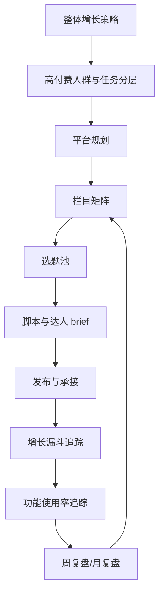

# Kimi 社媒增长与文档体系总纲

更新日期：2026-07-02

## 1. 体系目标

这套体系不是内容灵感库，而是 Kimi Agent / Kimi Work 的社媒增长操作系统。

它要同时解决 2 个业务问题：

1. 新用户增长：尤其是高付费意愿、高任务压力、高资料密度、高交付要求的人群。
2. 新功能渗透：把 Kimi Agent、Kimi Work、Agent Swarm、Docs、Slides、Sheets、Websites、Deep Research、Scheduled Tasks 等功能包装成用户能理解、能试用、能复用的工作场景。

## 2. 总链路

## 3. Claude 内容建设给 Kimi 的底层启发

Claude 的内容建设强在“教育体系”，不是单点爆款。

| Claude 做法 | Kimi 转译 |
|---|---|
| Claude 101 | Kimi Work 101：新用户第一周真实任务 |
| AI Fluency | Agent Fluency：委派、描述、判断、迭代 |
| Claude for Work | Kimi for Work：岗位和团队任务 |
| Claude Cowork course | Kimi Work Task Loop：目标 -> 计划 -> 执行 -> 校验 -> 交付 |
| Use cases | 某某行业怎么用 Kimi |
| Docs / Skills / MCP | Kimi Agent 进阶课 |
| Trust / policy / enterprise | Kimi 安心用：权限、资料、校验、边界 |

关键结论：Kimi 内容不能只做“功能发布”，要做“用户能力建设”。用户越会把复杂任务交给 Kimi，越可能持续使用和付费。

## 4. 业务目标拆解

| 层级 | 目标 | 对应文档 |
|---|---|---|
| 战略 | 明确 Kimi 在社媒上的定位和增长目标 | `docs/01-growth-masterplan.md` |
| 指标 | 定义北极星、预算、漏斗、功能使用率 | `docs/02-goals-budget-metrics.md`、`docs/16-growth-funnel-and-feature-usage.md` |
| 人群 | 定义高付费意愿人群和任务 | `docs/09-competitor-deep-dive.md`、`docs/13-kimi-topic-bank-80.md` |
| 平台 | 明确各平台角色、栏目、频率、CTA | `docs/12-kimi-platform-content-strategy.md` |
| 栏目 | 规定栏目结构和验收标准 | `docs/03-content-pillars.md`、`docs/12-kimi-platform-content-strategy.md` |
| 选题 | 提供可排期选题池 | `docs/13-kimi-topic-bank-80.md` |
| 脚本 | 提供可拍摄/改写脚本 | `docs/14-first-batch-content-scripts.md` |
| 达人 | 规定达人筛选、brief、验收、复投 | `docs/04-creator-campaign-playbook.md` |
| GTM | 每次功能发布的场景包装和检查清单 | `docs/05-gtm-checklist.md` |
| 复盘 | 每周/月如何看数据并调整 | `docs/06-weekly-review-operating-rhythm.md`、`templates/weekly-funnel-review-template.md` |

## 5. 高付费人群与任务层

高付费意愿不是由身份决定，而是由任务强度决定。

| 人群 | 付费意愿来源 | 核心任务 | 主平台 |
|---|---|---|---|
| 产品/运营/市场 | 高频交付、老板压力、跨部门协作 | 竞品、GTM、复盘、用户分析 | 小红书、B 站、知乎、公众号 |
| 咨询/投研/商业分析 | 时间贵、资料密度高、输出标准高 | 研究、摘要、对比、报告 | B 站、知乎、公众号 |
| 小团队经营者 | 缺人、缺流程、需要一人多岗 | 市场、销售、内容、管理 | 视频号、公众号、社群 |
| 内容创作者/知识博主 | 内容产能和收入挂钩 | 选题、脚本、资料、账号分析 | 小红书、抖音、B 站 |
| 求职/留学/研究生 | 节点强、愿意为关键结果付费 | 简历、面试、论文、申请 | 小红书、B 站、知乎 |
| 管理者/项目经理 | 会议、复盘、推进成本高 | 纪要、行动、风险、周会 | 视频号、公众号 |

## 6. 平台层

平台不是分发渠道，而是用户旅程中的不同节点。

| 平台 | 在漏斗里的角色 |
|---|---|
| 小红书 | 场景发现、收藏、模板领取 |
| 抖音/视频号 | 强演示、低门槛认知、破圈 |
| B 站 | 深度教育、信任、复杂任务证明 |
| 知乎 | 搜索承接、理性解释、竞品横评 |
| 公众号 | 资产沉淀、模板包、私域转化 |
| 即刻/微博 | 节点扩散、产品讨论、快速反馈 |
| 社群 | 任务完成、案例征集、留存复用 |

## 7. 栏目层

所有栏目按用户成熟度排列：

| 阶段 | 栏目 | 目标 |
|---|---|---|
| 认知 | Kimi Work 101 | 让用户知道 Kimi 能完成真实任务 |
| 首用 | Kimi 模板库 | 让用户复制模板并完成第一次任务 |
| 熟练 | Agent Fluency | 让用户学会委派和迭代 |
| 场景 | 某某岗位怎么用 Kimi | 让高价值人群看到自己的工作流 |
| 功能 | Kimi Agent Task Loop | 让新功能被场景化使用 |
| 信任 | Kimi 安心用 | 解决企业/高付费用户的风险顾虑 |
| 口碑 | 用户工作流改造 | 把 UGC 变成案例和复投素材 |

## 8. 内容资产层

每条内容必须归档成至少一种资产：

| 资产 | 说明 |
|---|---|
| 任务卡 | 用户可以直接照做的任务描述 |
| Prompt 模板 | 可以复制到 Kimi 的任务模板 |
| 结果样例 | 展示最终文档、表格、PPT、清单 |
| 脚本 | 可给官方账号和达人复用 |
| 案例 | 用户/达人真实使用过程 |
| 数据记录 | 曝光、互动、点击、任务完成、功能使用 |

## 9. 数据层

所有内容最终要回到两类数据：

1. 增长漏斗：曝光 -> 互动 -> 点击/搜索 -> 注册/登录 -> 首次任务 -> 高价值任务 -> 留存/付费意向。
2. 功能使用率：看到内容的人是否真的用了 Kimi Agent / Kimi Work 的对应功能。

详细口径见 `docs/16-growth-funnel-and-feature-usage.md`。

## 10. 复盘层

复盘不是报数，而是做决策。

| 复盘问题 | 决策 |
|---|---|
| 哪个平台带来了高价值任务完成？ | 下周加码或减码 |
| 哪个栏目收藏高但任务完成低？ | 优化 CTA 和落地页 |
| 哪个功能曝光高但使用率低？ | 重做场景包装 |
| 哪类达人带来了真实任务完成？ | 复投并系列化 |
| 哪些用户问题反复出现？ | 做成 FAQ、教程、模板 |

## 11. 团队工作流

| 时间 | 动作 | 产出 |
|---|---|---|
| 周一 | 看漏斗、定本周主战场 | 本周目标和排期 |
| 周二 | 生产脚本、达人 brief | 内容 brief、达人 brief |
| 周三 | 发布与互动承接 | 评论问题、模板领取数据 |
| 周四 | 功能使用率检查 | 功能渗透数据、落地页调整 |
| 周五 | 周复盘 | 加码/停止/调整/资产化 |
| 月末 | 月度复盘 | 预算、人群、栏目、功能 GTM 调整 |

## 12. 最小可运行版本

第一月先跑 4 个核心闭环：

1. 小红书 `Kimi Work 101 + 模板库`：验证收藏和首用。
2. 抖音/视频号 `一分钟交给 Kimi`：验证演示破圈。
3. B 站 `Kimi Work 从 0 到 1`：验证深度信任。
4. 社群 `每日任务挑战`：验证高价值任务完成和功能使用率。
