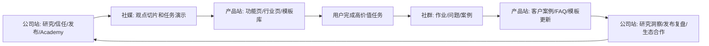
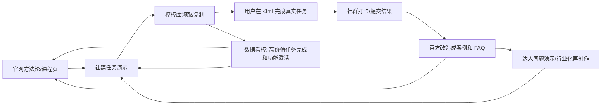

# Claude 内容系统给 Kimi 的内容建设方法论

更新日期：2026-07-02

## 1. 一句话结论

Claude / Anthropic 的内容系统不是“功能介绍 + 案例种草”，而是一套把用户从“知道 AI”训练成“会把真实工作交给 AI”的能力建设系统。它的增长逻辑是：

`认知叙事 -> 学习路径 -> 角色/行业场景 -> 产品 task loop -> 课程/文档承接 -> 信任安全 -> 社区/生态 -> 模板和案例反哺`

Kimi 要借鉴的不是 Claude 的英文表达，而是这套内容操作系统：把 Kimi 从“中文 AI 工具”讲成“复杂工作交付系统”，让用户学会把资料、目标、限制、过程校验和最终交付物放进同一个工作流里。

## 2. Claude 内容系统到底怎么运作

Claude 的内容建设有 7 个关键动作。

1. **先定义新能力，而不是先讲新功能。** AI Fluency 把“会不会用 AI”变成一种可学习、可测量的工作能力；Claude Cowork / Code 把“会不会用 agent”变成“能不能给目标、看计划、审结果、交付产物”。
2. **用课程做入口，用产品页做心智，用 docs 做深水区。** Claude for You / Work 负责分流，Skilljar Academy 负责系统学习，use case guides 和 developer docs 负责把高意愿用户承接到可执行流程。
3. **每个产品都绑定一个 task loop。** Cowork 的核心不是“桌面版 Claude”，而是“给目标 -> 读取真实文件/应用 -> 规划执行 -> 返回交付物 -> 人类审批”；Code 的核心不是“补全代码”，而是“读代码库 -> 跨文件修改 -> 跑测试 -> 修 CI -> 提交代码”。
4. **每个 use case 都像生产指南。** 不是“客服可以用 Claude”，而是先判断是否适合 LLM，再拆现有流程、定义分类/成功指标、选择模型、写 prompt、部署、评估、加 guardrails。
5. **信任内容嵌在转化链路里。** Agent 能做更多事，用户就会担心权限、隐私、误操作、提示注入、事实错误。Claude 在产品页、研究页、docs 和小企业页反复给出人类控制、透明过程、既有权限继承、审批和安全边界。
6. **生态内容把产品能力变成社会证明。** Small Business 把连接器、workflow、真实商户、PayPal/QuickBooks/HubSpot/Canva 等伙伴、线下巡回培训和免费课程放在一起，形成“工具 + 教育 + 伙伴 + 社区”的组合拳。
7. **所有内容最终沉淀为可复用资产。** 课程、模板、cookbook、Skill、connector、case study、docs、FAQ 互相引用，用户每进一步都能拿到下一步材料。

## 3. 先拆站点：Anthropic 公司站 vs Claude 产品站

用户看到的不是一个“官网”，而是两个不同任务的内容系统：Anthropic.com 负责公司级权威和信任，Claude / claude.com 负责产品转化和使用承接。Kimi 如果把这两件事混在一个内容入口里，就会出现两个问题：公司级可信内容太像产品广告，产品页又承担过多理念解释，导致用户既没有被说服，也没有顺利开始使用。

### 3.1 两类站点的战略分工

| 站点 | 核心任务 | 内容角色 | 用户心理 | 典型栏目/页面 | 主要 CTA |
|---|---|---|---|---|---|
| Anthropic.com | 建立公司级信任、研究权威、政策立场、教育体系和发布中心 | “为什么这家公司值得信任，为什么这个技术方向重要” | 我是否相信这家公司、它是否负责任、它是否懂 AI 对工作和社会的影响 | Research、Policy、Commitments、Transparency、Academy、News、Events、Partnerships、AI Fluency | Read research、Take course、Learn policy、Try Claude、Request demo |
| Claude / claude.com | 把 Claude 变成可购买、可上手、可复用的产品系统 | “我现在能用 Claude 做什么，怎么开始，谁已经在用” | 这是不是适合我的任务、我的团队、我的行业；我下一步点哪里 | Product pages、feature pages、industry pages、connectors、plugins、customer stories、courses center、templates、pricing | Start using、Download app、Request demo、Install connector、Use template |

这两个站点不是重复关系，而是上下游关系：

`公司站负责相信 -> 产品站负责开始 -> 课程/模板负责上手 -> 案例/社群负责复用 -> 公司站再用研究和政策巩固长期信任`

### 3.2 Kimi 可复制的双站点架构

Kimi 也应该把“品牌/公司叙事”和“产品/场景转化”拆开。即使最终域名和产品命名不完全一致，也要在信息架构上分成两套入口。

| Kimi 站点层 | 目标 | 一级栏目 | 栏目要回答的问题 | 内容形式 | CTA |
|---|---|---|---|---|---|
| Kimi 公司/品牌站 | 建立 Kimi 在中文复杂工作、可信 AI、AI 工作能力教育上的权威 | 研究与洞察、信任与安全、Kimi Academy、发布中心、伙伴与生态、社会影响 | Kimi 对 AI 工作方式有什么判断？Kimi 如何处理安全、隐私和责任？用户为什么应该长期相信 Kimi？ | 研究报告、AI 工作能力指数、信任白皮书、政策说明、发布公告、课程总纲、生态合作案例 | 阅读报告、开始课程、查看信任中心、了解发布、申请合作 |
| Kimi 产品站 | 促成注册、使用、付费、功能激活和行业转化 | Kimi Work、Kimi Agent、Deep Research、Docs/Slides/Sheets、行业解决方案、连接器/插件、模板库、客户案例、课程中心、价格/团队版 | 我能用 Kimi 完成什么任务？我这个岗位/行业怎么用？怎么接入我的工具？怎么马上复制模板开始？ | 产品页、功能页、行业页、工作流页、模板页、客户故事、演示视频、交互 demo、课程落地页 | 立即使用、复制模板、下载 App、安装连接器、申请团队演示、加入任务营 |

### 3.3 公司站栏目体系

公司站要避免变成“产品功能新闻站”。它的任务是建立长期话语权，给高付费用户、媒体、政策相关方、企业采购和教育合作方一个可信入口。

| 栏目 | 对标逻辑 | Kimi 应写什么 | 社媒可拆内容 | 沉淀资产 |
|---|---|---|---|---|
| `Kimi AI 工作能力研究` | AI Fluency Index / Economic Index | 中文用户如何把 AI 用进学习、职场、内容、经营和研究；哪些行为决定高质量 AI 协作 | “会用 AI 的人都做对了什么”“为什么只问一句不等于会用 AI” | 年度/季度报告、指标体系、媒体引用素材 |
| `Kimi Agent Fluency` | AI Fluency / Academy | Agent 时代用户需要的任务识别、目标委派、上下文装配、工作流拆解、过程校准、结果验收能力 | 六力模型图文、课程切片、作业案例 | 课程总纲、能力评估、证书、作业库 |
| `Kimi 信任中心` | Transparency / Security / Policy | 文件权限、数据隐私、人工审批、输出验收、高风险任务边界、团队管理 | “哪些资料不要交给 AI”“Kimi 输出如何复核” | 信任白皮书、FAQ、团队使用规范、验收清单 |
| `Kimi 发布中心` | News / Product announcements | 新模型、新功能、新合作、新课程、新行业包，但必须连接到用户价值 | 发布金句、功能场景图、路线图切片 | 发布档案、媒体包、功能 GTM 清单 |
| `Kimi 伙伴与生态` | Partner network / events / ecosystem | 与工具、教育机构、行业组织、达人、服务商共建 Kimi 工作流 | 伙伴案例、线下活动、共创计划 | 伙伴目录、活动页、联合课程 |
| `Kimi 社会影响/教育` | education initiatives / nonprofits / public benefit | 面向学生、教育者、小团队、公益组织的 AI 能力培训 | 公开课、公益训练营、校园案例 | 课程包、训练营材料、合作案例 |

公司站的内容标准：每篇都要能回答“为什么 Kimi 值得信任”和“这件事对 AI 工作方式有什么长期意义”，而不是只给产品入口。

### 3.4 产品站栏目体系

产品站要避免把用户带进长篇理念解释。它的任务是让用户快速判断“适不适合我”，然后马上开始一个任务。

| 栏目 | 对标逻辑 | Kimi 应写什么 | 页面模块 | CTA |
|---|---|---|---|---|
| `Kimi Work` | Claude Cowork | 从真实文件、网页、表格、资料夹到可交付文档/表格/PPT/报告 | 适用任务、输入材料、task loop、结果样例、权限说明、模板入口 | 立即新建 Work 任务 |
| `Kimi Agent` | Claude Code / agentic products | 目标委派、计划执行、多步任务、工具调用、人工校准 | 目标示例、执行流程、可见计划、审批点、常见任务 | 用 Agent 跑一个任务 |
| `功能页` | Artifacts / Projects / Skills / Research / integrations | Deep Research、Docs、Slides、Sheets、Websites、Scheduled Tasks 等分别服务什么任务 | 功能一句话、3 个高频场景、演示视频、模板、FAQ | 使用功能模板 |
| `行业/岗位页` | Claude for Work / use cases | 产品、运营、市场、销售、HR、咨询、研究生、小团队怎么用 Kimi | 人群痛点、任务地图、工作流、样例输出、模板包、案例 | 领取岗位模板 |
| `连接器/插件页` | Connectors / plugins / tool ecosystem | Kimi 如何连接浏览器、文档、表格、网盘、企业工具和内容平台 | 支持工具、权限说明、安装步骤、示例 workflow | 安装连接器 |
| `客户案例` | Customer stories | 用户从什么任务出发，用 Kimi 产出了什么结果，节省了什么流程 | 原始问题、Kimi 工作流、产出结果、数据/证言、可复制模板 | 复制同款工作流 |
| `课程中心` | Courses center | 产品上手课、岗位课、Agent Fluency 实战课、团队训练营 | 课程路径、课时、作业、模板包、结业标准 | 开始学习 |
| `模板库` | cookbook / ready-to-run workflows | 每个模板都绑定任务、材料、输出和验收 | 任务卡、prompt、材料清单、结果样例、验收 checklist | 复制模板 |

产品站的内容标准：每页都要有明确人群、任务、输入、过程、输出、CTA 和模板。没有模板或演示的产品页，很难承接社媒流量。

### 3.5 两站之间的跳转规则

| 起点 | 用户问题 | 应跳到哪里 | 示例 |
|---|---|---|---|
| 公司站研究报告 | 我理解了趋势，但怎么用？ | 产品站行业/模板页 | `AI 工作能力研究 -> Kimi Agent Fluency 课程 -> 竞品分析模板` |
| 公司站信任中心 | 我担心文件、权限和准确性 | 产品站对应功能页的安全模块 | `文件权限说明 -> Kimi Work 文件任务页 -> 验收 checklist` |
| 公司站发布中心 | 新功能发布了，能解决什么任务？ | 产品站功能页和模板页 | `Deep Research 发布 -> 市场调研工作流 -> 模板库` |
| 产品站功能页 | 我想知道是否可信 | 公司站信任中心/研究页 | `Kimi Agent 页面 -> 人工控制和审批说明` |
| 产品站行业页 | 我想系统学会这个岗位工作流 | 课程中心/社群训练营 | `运营怎么用 Kimi -> 7 天运营任务营` |
| 产品站模板页 | 我完成了一个任务，下一步怎么复用？ | 社群/案例征集/达人共创 | `周报模板 -> 社群打卡 -> 官方案例页` |

### 3.6 Kimi 的双站内容飞轮



在这个飞轮里，公司站负责“相信 Kimi”，产品站负责“使用 Kimi”，社媒负责“让用户看见具体任务”，社群负责“让用户真的做完任务”，模板库负责“让成功任务能被复用”。

## 4. 七层内容层级与 Kimi 转译

### 4.1 认知叙事层

Claude 的做法：从“chat is useful but not always the right tool”切入，把心智从聊天升级到 agentic work；AI Fluency 则把“ adoption ”和“ impact ”区分开，告诉用户：用了 AI 不等于用得好。

Kimi 应该建立的叙事：Kimi 不是问答入口，而是中文复杂工作的交付系统。核心表达不应是“更聪明的大模型”，而是“你把目标、资料和标准交给 Kimi，Kimi 帮你推进到可检查的结果”。

| Kimi 动作 | 建议 |
|---|---|
| 栏目 | `Kimi Work 101`、`Agent Fluency`、`不是问一句，是交付一件事`、`从聊天到交付` |
| 内容形式 | 认知长文、短视频前后对比、B 站深度课、官网方法论页 |
| 平台适配 | 官网承接完整框架；B 站讲系统方法；小红书/抖音用“原始任务 -> 最终交付物”做结果演示；知乎/公众号解释为什么复杂任务不能只靠 prompt |
| CTA | “完成你的第一个高价值任务”“领取 Kimi Work 101 任务包”“把你的任务发到社群改造成 Kimi 工作流” |
| 资产沉淀 | Kimi Work 101 页面、第一周任务清单、任务前后对比案例、Agent Fluency 总纲 |

### 4.2 学习路径层

Claude 的做法：Claude for You 和 Claude for Work 分别承接个人与组织；Skilljar Academy 提供 Claude 101、AI Fluency、Claude Cowork、Claude Code、API、MCP、Skills、AI Fluency for educators/students/nonprofits/small businesses/builders 等课程。它不是把内容散发出去，而是给用户一条“新手 -> 熟练 -> 进阶 -> 角色化”的路线。

Kimi 应建立 4 条学习路径：

| 路径 | 人群 | 目标 | 课程/栏目 |
|---|---|---|---|
| 个人上手 | 新用户、学生、求职者、创作者 | 7 天内完成一个真实交付物 | `Kimi Work 101`、`第一次把资料交给 Kimi` |
| 职场进阶 | 产品、运营、市场、咨询、研究 | 把 Kimi 放进日常交付链路 | `Agent Fluency`、`某岗位怎么用 Kimi` |
| 小团队工作包 | 创业者、小商家、工作室、ToB 小团队 | 用 Kimi 补齐缺人、缺流程、缺分析的问题 | `Kimi for Small Teams`、`一人公司 AI 工作流` |
| 高阶 agent | agent 重度用户、开发者、自动化用户 | 学会工具、文件、网页、多 agent、定时任务、模板复用 | `Kimi Agent 进阶课`、`Kimi Skills / 模板化工作流` |

| Kimi 动作 | 建议 |
|---|---|
| 栏目 | `Kimi Academy`、`Kimi Work 101`、`Agent Fluency Bootcamp`、`Kimi Agent 进阶课` |
| 内容形式 | 课程页、章节化视频、打卡营、测验、结业证书、模板包 |
| 平台适配 | 官网做课程目录；B 站做完整课程；公众号做课程讲义；社群做 7 天打卡；小红书做每节课的任务卡 |
| CTA | “开始课程”“加入 7 天任务营”“提交作业换模板包”“完成后领取证书/案例收录” |
| 资产沉淀 | 课程目录、任务作业、标准答案样例、用户作业库、证书/徽章、常见问题库 |

### 4.3 角色/行业 use case 层

Claude 的做法：Claude for Work 先按 Engineering、HR、Marketing、Product Management、Sales、team offsite 等角色入口组织内容；docs 的 use case guides 再把具体场景写成生产指南，例如 customer support agent、ticket routing、content moderation、legal summarization。它的关键不是列岗位，而是把每个岗位的任务拆成“什么时候适合用 AI、输入是什么、输出是什么、怎么评估、有什么边界”。

Kimi 应把“某某岗位怎么用 Kimi”升级成三层结构：

1. **岗位任务图谱。** 这个岗位一天/一周最重的任务是什么。
2. **Kimi 工作流。** 每个任务要给 Kimi 什么材料、让 Kimi 怎么拆、最后交付什么。
3. **验收和风险。** 结果怎么检查，哪些地方需要人工判断，哪些数据不能乱传。

| Kimi 动作 | 建议 |
|---|---|
| 栏目 | `产品经理怎么用 Kimi`、`运营怎么用 Kimi`、`市场人怎么用 Kimi`、`咨询/投研怎么用 Kimi`、`研究生怎么用 Kimi`、`小团队老板怎么用 Kimi` |
| 内容形式 | 岗位工作流长文、岗位任务地图、短视频单任务演示、可复制 prompt、原始材料包、结果样例 |
| 平台适配 | 小红书做岗位痛点和模板收藏；B 站做完整工作流；知乎做搜索型问答；公众号做岗位手册；社群做真实任务共创 |
| CTA | “领取该岗位 10 个 Kimi 模板”“提交你的岗位任务，帮你改成 Kimi 工作流”“下载原始材料跟做” |
| 资产沉淀 | 岗位工作流库、任务卡、prompt 模板、结果样例、岗位 FAQ、达人 brief |

首批高价值角色包：

| 角色/行业 | 高痛任务 | Kimi 可交付物 |
|---|---|---|
| 产品经理 | 竞品分析、PRD 梳理、需求聚类、版本复盘 | 竞品矩阵、需求优先级表、PRD 大纲、复盘 memo |
| 运营/增长 | 活动复盘、用户反馈分析、内容日历、社群任务 | 复盘报告、用户分层、30 天内容表、社群任务卡 |
| 市场/品牌 | GTM、campaign 策略、素材拆解、竞品社媒追踪 | GTM plan、campaign brief、标题库、竞品内容表 |
| 咨询/投研 | 资料阅读、行业研究、公司对比、访谈整理 | 研究报告、观点地图、访谈洞察、汇报大纲 |
| HR/求职 | JD 分析、简历匹配、面试题、候选人评估 | 匹配版简历、面试准备表、候选人评分表 |
| 小团队经营者 | 销售跟进、财务/现金流摘要、发票/合同、营销活动 | 客户跟进清单、经营周报、合同要点、活动执行包 |

### 4.4 产品 task loop 层

Claude 的做法：Cowork 和 Code 都用“agentic, not autocomplete / outcome, not prompt”建立产品任务循环。用户不需要把工作拆成一条条 prompt，而是给目标和材料，Claude 自己规划、行动、观察结果、调整，直到交付或需要人类确认。

Kimi 应明确自己的 `Kimi Agent Task Loop`：

```text
目标定义 -> 材料装配 -> 计划确认 -> 多步执行 -> 中途校准 -> 结果验收 -> 资产沉淀
```

| 环节 | 用户学会什么 | 内容要展示什么 | CTA |
|---|---|---|---|
| 目标定义 | 不问“帮我写”，而说清业务目标、受众、成功标准 | 原始需求如何改成任务委派 | 复制任务描述模板 |
| 材料装配 | 上传文件、网页、表格、截图、历史资料 | 输入材料列表和缺失信息提示 | 下载材料清单 |
| 计划确认 | 让 Kimi 先拆步骤、问澄清问题、列风险 | Kimi 的计划页/步骤页/待办页 | 试一次“先出计划再执行” |
| 多步执行 | 让 Kimi 调用搜索、文档、表格、agent、定时任务 | 中间过程，不只展示最终回答 | 打开对应功能 |
| 中途校准 | 发现方向偏了就改标准、补上下文、收窄范围 | 用户如何追问、打断、改 brief | 领取迭代检查表 |
| 结果验收 | 查事实、查引用、查遗漏、查格式、查是否能交付 | 验收前后对比 | 用验收清单复查你的结果 |
| 资产沉淀 | 把成功任务变成模板、技能、社群案例、达人脚本 | 任务如何进入模板库 | 投稿你的工作流 |

| Kimi 动作 | 建议 |
|---|---|
| 栏目 | `一分钟交给 Kimi`、`从文件夹到交付物`、`Kimi Agent Task Loop`、`今天让 Kimi 完成一件事` |
| 内容形式 | 屏幕录制、流程图、任务前后对比、任务复盘、可下载检查表 |
| 平台适配 | 抖音/视频号展示 30-90 秒 task loop；B 站拆完整复杂任务；小红书突出材料和结果；官网沉淀交互式案例 |
| CTA | “把你的任务按这个格式交给 Kimi”“下载 task loop 检查表”“进入 Kimi Work 新建任务” |
| 资产沉淀 | 标准 task loop 模板、任务验收清单、场景化落地页、功能激活事件映射 |

### 4.5 课程/文档承接层

Claude 的做法：轻内容负责引发兴趣，Academy 负责系统学习，docs / cookbook / API / Skills 负责深度承接。Agent Skills 文档尤其值得借鉴：它把技能解释成“给 Claude 的模块化能力包”，并用 metadata、instructions、resources/scripts 的渐进式加载机制说明为什么 Skills 不是一次性 prompt，而是可复用工作能力。

Kimi 应把内容资产做成多级承接：

| 用户状态 | 应看到什么 | 下一步 |
|---|---|---|
| 刚被种草 | 一条真实任务演示 | 领取同款任务模板 |
| 想照做 | 任务卡 + 原始材料 + prompt | 打开 Kimi 完成首用 |
| 想系统学 | 章节化课程和作业 | 加入打卡营/课程页 |
| 想复用 | 模板库、工作流包、技能说明 | 保存为个人模板/团队模板 |
| 想深入 | docs、FAQ、功能边界、评估方法 | 使用高阶功能或团队版 |

| Kimi 动作 | 建议 |
|---|---|
| 栏目 | `Kimi 模板库`、`Kimi Cookbook`、`Kimi Work 手册`、`Kimi Skills/工作流包` |
| 内容形式 | 模板详情页、cookbook、FAQ、功能 docs、可复制文件夹、课程讲义 |
| 平台适配 | 官网做唯一权威入口；公众号做合集；社群做模板共创；达人拿模板拍自己的任务版本 |
| CTA | “下载模板包”“保存到我的 Kimi”“查看进阶文档”“用这个模板跑你的真实资料” |
| 资产沉淀 | 模板库、原始材料库、示例输出库、常见错误库、功能 docs、工作流版本记录 |

### 4.6 信任安全层

Claude 的做法：Agent 叙事越强，越需要信任叙事托底。Claude 的信任内容反复强调：人类保持控制、agent 行为透明、权限可配置、已有系统权限不被绕过、隐私隔离、提示注入防护、默认谨慎、关键动作要审批、输出要核查。

Kimi 应把信任内容做成“安心用 Kimi Work”的持续栏目，而不是只放在隐私政策页。

| Kimi 动作 | 建议 |
|---|---|
| 栏目 | `Kimi 安心用`、`Kimi 输出怎么验收`、`哪些任务必须人工复核`、`文件和权限怎么处理` |
| 内容形式 | FAQ、短视频辟谣、企业/团队版说明、验收清单、风险场景复盘、对比图 |
| 平台适配 | 知乎/公众号讲清边界；B 站做复杂任务验收课；官网做信任中心；社群固定答疑 |
| CTA | “用验收清单检查结果”“查看 Kimi 安全和权限说明”“下载团队使用规范” |
| 资产沉淀 | 信任中心、输出验收 checklist、团队使用规范、敏感资料处理指南、风险案例库 |

Kimi 信任内容的 6 个固定主题：

1. **人工控制。** 哪些动作需要用户确认，如何中途打断和调整。
2. **过程透明。** Kimi 做了哪些步骤、用了哪些资料、哪里不确定。
3. **权限边界。** 文件、网页、账号、团队资料分别如何授权和管理。
4. **事实核查。** 引用、来源、表格计算、法律/财务/医疗等高风险输出如何复核。
5. **数据隐私。** 什么数据不该上传，团队资料怎么分级。
6. **结果责任。** Kimi 负责推进，人类负责判断和最终发布。

### 4.7 社区/生态层

Claude 的做法：Small Business 页不是单纯发布产品包，而是把 connectors、ready-to-run workflows、15 个 skills、真实客户证言、合作伙伴、AI Fluency 课程、线下城市巡回、非营利合作放在一个叙事里。它让用户相信：这不是一个孤立功能，而是一套正在进入真实业务现场的生态。

Kimi 应把社群、达人、模板库、官网和平台内容串起来：

| Kimi 动作 | 建议 |
|---|---|
| 栏目 | `Kimi 工作流改造`、`Kimi 模板共创`、`Kimi 小团队 AI 工作包`、`达人同题任务挑战` |
| 内容形式 | 任务挑战、用户案例复盘、达人同题视频、线下/直播训练营、模板共创榜单 |
| 平台适配 | 社群跑任务和收作业；达人做真实场景演示；官网沉淀案例；公众号做月度合集；B 站做深度复盘 |
| CTA | “提交你的任务被官方改造”“报名直播工作坊”“领取本月模板包”“达人用同一份材料挑战 Kimi” |
| 资产沉淀 | UGC 案例库、达人脚本库、模板排行榜、行业任务库、直播回放和讲义 |

## 5. Kimi 可采用的 Agent Fluency 框架

Claude 的 AI Fluency 以 Delegation、Description、Discernment、Diligence 为核心，并用可观察行为衡量用户是否会迭代、是否会明确目标、是否会给格式/示例、是否会识别缺失上下文、是否会质疑推理和核查事实。

Kimi 的 Agent Fluency 要更贴近 agent 和复杂工作，建议升级为“六力 + 一条责任线”。

### 5.1 六力模型

| 能力 | 用户要学会什么 | 典型行为 | 内容训练方式 | 可观察指标 |
|---|---|---|---|---|
| 任务识别力 | 判断什么工作适合交给 Kimi，什么必须自己做 | 把“查资料、整理、对比、生成、复盘”交给 Kimi，把最终判断留给自己 | 任务适配清单、适合/不适合案例 | 用户是否选择高价值任务，而不是只问闲聊问题 |
| 目标委派力 | 把目标、受众、限制、成功标准说清楚 | “请面向老板做 5 页汇报大纲，重点是机会点和风险” | 任务描述公式、改写练习 | 是否包含目标、对象、交付物、标准、截止时间 |
| 上下文装配力 | 提供资料、来源、样例、历史版本和限制 | 上传文件、贴链接、给参考格式、说明禁区 | 材料清单、资料夹到交付物演示 | 是否上传/引用材料，是否说明缺失信息 |
| 工作流拆解力 | 让 Kimi 先计划、再执行，必要时拆 agent | 要求先列步骤、分工、风险和检查点 | task loop 教程、多 agent 分工案例 | 是否要求计划，是否有中途 checkpoint |
| 过程校准力 | 不接受第一版，能追问、纠偏、补充上下文 | 让 Kimi 解释假设、重排结构、改口径、补数据 | 迭代前后对比、错误修正案例 | 是否进行多轮迭代，是否提出具体修改 |
| 结果验收力 | 检查事实、来源、格式、遗漏、适用边界 | 要求引用、核对表格、列不确定性、生成验收清单 | 输出验收 checklist、高风险任务复核课 | 是否要求事实核查、引用、风险提示、人工复核 |

责任线：**安全和归属感。** 用户要知道哪些资料不能上传，哪些结论不能直接发布，哪些场景需要专业人士确认，什么时候要披露 AI 辅助。它贯穿六力，而不是单独一节安全教育。

### 5.2 Agent Fluency 课程设计

| 阶段 | 课程 | 作业 | 产出 |
|---|---|---|---|
| 0. 认知 | AI 不只是聊天，Kimi 是复杂工作交付系统 | 把一个模糊需求改成任务 brief | 标准任务 brief |
| 1. 任务识别 | 哪些任务适合交给 Kimi | 标记自己一周的 10 个任务 | 个人任务地图 |
| 2. 目标委派 | 如何写一个可执行目标 | 把“帮我写报告”改成 3 个不同交付标准 | 任务描述模板 |
| 3. 上下文装配 | 如何准备文件、链接、样例和约束 | 给 Kimi 一组材料，要求输出结构化摘要 | 材料清单 |
| 4. 工作流拆解 | 如何让 Kimi 先计划再执行 | 要求 Kimi 拆一个竞品分析计划 | task loop 计划 |
| 5. 过程校准 | 如何中途追问和纠偏 | 对第一版结果做 3 次有效修改 | 迭代记录 |
| 6. 结果验收 | 如何验证输出能不能交付 | 用 checklist 查一份 Kimi 输出 | 验收表 |
| 7. 资产复用 | 如何把成功任务变成模板 | 把一次任务做成模板库条目 | 模板卡 |

### 5.3 Agent Fluency 内容栏目

| 栏目 | 目标 | 示例选题 | CTA |
|---|---|---|---|
| `把需求交给 Kimi 前先改这 5 句话` | 训练目标委派力 | “帮我做竞品分析”怎么改成可执行任务 | 复制任务 brief |
| `Kimi 缺什么信息会做不好` | 训练上下文装配力 | 做市场调研前必须给 Kimi 的 8 类材料 | 下载材料清单 |
| `先让 Kimi 出计划，不要直接写` | 训练工作流拆解力 | 一个活动复盘如何拆成 6 步 | 打开 task loop 模板 |
| `第一版不是最终版` | 训练过程校准力 | 3 轮追问把普通周报改成老板能看的版本 | 领取迭代话术 |
| `Kimi 输出怎么验收` | 训练结果验收力 | 竞品分析里的数字、引用、结论怎么查 | 下载验收 checklist |
| `把一次成功任务变模板` | 训练资产复用力 | 把简历优化流程保存成下次可用模板 | 投稿模板库 |

### 5.4 Agent Fluency 衡量指标

| 指标 | 说明 |
|---|---|
| 高价值任务开始率 | 用户是否从内容进入文档、表格、研究、PPT、复盘等复杂任务 |
| 上下文充分率 | 任务是否包含文件/链接/样例/格式/约束 |
| 计划确认率 | 用户是否让 Kimi 先给计划或分步骤执行 |
| 迭代轮次 | 用户是否对第一版结果进行有效追问和修改 |
| 验收动作率 | 用户是否要求引用、核查、总结不确定性、输出 checklist |
| 模板沉淀率 | 成功任务是否被保存、复制、分享或进入模板库 |
| D7 复用率 | 用户 7 日内是否用同类模板完成第二个任务 |

## 6. Kimi 官网、社媒、社群、达人、模板库的内容飞轮

Kimi 的内容系统不能是“各平台各发各的”。建议用一个内容飞轮连接所有触点：



### 6.1 各触点分工

| 触点 | 负责什么 | 不负责什么 | 核心 CTA | 沉淀资产 |
|---|---|---|---|---|
| 官网 | 权威方法论、课程目录、模板总入口、信任中心 | 不追热点，不做碎片种草 | 开始课程、进入模板库、查看信任说明 | playbook、课程页、模板页、案例页 |
| 小红书 | 场景发现、收藏、模板领取 | 不讲复杂原理 | 评论关键词、收藏照做、领取模板 | 任务卡、图文模板、结果截图 |
| 抖音/视频号 | 快速演示、破圈、降低理解门槛 | 不承载完整方法论 | 搜索 Kimi、点击链接、评论任务 | 短视频脚本、前后对比素材 |
| B 站 | 深度教学、复杂任务证明 | 不追求单条极短转化 | 下载资料包、关注系列课 | 课程视频、原始材料包、复盘稿 |
| 知乎/公众号 | 搜索承接、理性解释、信任建设 | 不做过度口播式演示 | 阅读手册、领取模板包、进群 | 长文手册、FAQ、案例合集 |
| 社群 | 任务完成、作业反馈、案例征集 | 不只做闲聊 | 提交作业、参与挑战、报名直播 | UGC、问题库、真实工作流 |
| 达人 | 场景扩散、可信背书、行业语言翻译 | 不替代官方方法论 | 同题挑战、模板口令、进群 | 达人 brief、二创脚本、行业案例 |
| 模板库 | 把内容转成可复用入口 | 不做纯文章仓库 | 复制模板、保存工作流、上传材料 | prompt、材料清单、输出样例、验收清单 |

### 6.2 单条内容的标准流转

以“老板要一份竞品分析”为例：

1. 官网：建立 `Kimi 竞品分析工作流` 页面，包含适用人群、输入材料、task loop、结果样例、验收清单。
2. 小红书：发布“我把 5 个竞品链接交给 Kimi，拿到一份老板能看的竞品矩阵”，评论关键词领模板。
3. 抖音/视频号：60 秒展示从输入链接到输出表格和汇报大纲。
4. B 站：做 15 分钟完整跟做视频，附原始竞品链接和输出文档。
5. 社群：发起“本周竞品分析挑战”，用户提交自己的竞品列表。
6. 官方复盘：选 3 个用户案例，改造成岗位版案例和 FAQ。
7. 达人：产品经理、运营、创业者分别用同一套模板做行业化演示。
8. 模板库：沉淀为 `竞品分析任务卡`、`竞品矩阵 Sheet 模板`、`汇报大纲 Prompt`、`验收 checklist`。
9. 数据：追踪模板领取、到站、Kimi 首次任务、Deep Research / Sheets / Docs 使用、7 日复用。

### 6.3 飞轮的周运营节奏

| 时间 | 动作 | 产出 |
|---|---|---|
| 周一 | 从数据看板选择一个高潜任务 | 本周主任务和主功能 |
| 周二 | 产出官网/公众号长内容和模板 | 权威页、模板卡、材料包 |
| 周三 | 拆成小红书、抖音、视频号、即刻内容 | 多平台脚本和视觉素材 |
| 周四 | 社群发起任务挑战，收用户原始材料和结果 | 作业、问题、失败案例 |
| 周五 | 复盘内容到任务完成的转化 | 加码、停止、重写 CTA |
| 周末 | 达人同题或直播工作坊 | 行业化内容、直播回放 |

## 7. Kimi 内容资产库设计

每个栏目至少沉淀 1 个可复用资产，否则它只是一次发布。

| 资产 | 定义 | 文件/页面形态 |
|---|---|---|
| 任务卡 | 用户可以直接交给 Kimi 的任务描述 | Markdown、卡片图、模板库条目 |
| 材料清单 | 完成该任务需要准备的文件、链接、表格、截图 | checklist、示例文件夹 |
| Prompt/Brief | 可复制的任务委派文本 | 模板库、评论口令、社群置顶 |
| 结果样例 | Kimi 输出的文档、表格、PPT 大纲、报告、网页 | 截图、可下载样例、官网案例 |
| 迭代话术 | 用户如何让 Kimi 修改第一版 | 追问模板、短视频字幕 |
| 验收清单 | 查事实、查引用、查格式、查遗漏、查风险 | checklist、FAQ |
| 达人 brief | 达人如何拍同一任务 | brief 文档、镜头脚本、CTA |
| 用户案例 | 用户真实任务前后对比 | 官网 case、公众号复盘、B 站视频 |
| 数据记录 | 内容到功能使用的转化 | 看板、复盘表、实验日志 |

## 8. 首批可以直接启动的内容包

| 内容包 | 对标 Claude 逻辑 | 首批内容 | 关键 CTA |
|---|---|---|---|
| Kimi Work 101 | Claude 101 | 第一周 7 个真实任务：周报、竞品、会议纪要、文献、简历、活动复盘、PPT 大纲 | 完成第一个任务 |
| Agent Fluency | AI Fluency | 六力模型、任务 brief、材料清单、计划确认、迭代、验收 | 领取 Agent Fluency 作业包 |
| Kimi for Work | Claude for Work | 产品、运营、市场、销售、HR、咨询、研究生 | 领取岗位模板包 |
| Kimi Agent Task Loop | Claude Cowork/Code | 目标 -> 材料 -> 计划 -> 执行 -> 校准 -> 验收 -> 资产 | 打开 task loop 模板 |
| Kimi 小团队工作包 | Claude for Small Business | 销售跟进、现金流摘要、营销活动、合同审阅、客户反馈 | 加入小团队工作坊 |
| Kimi 模板库 | Academy/docs/cookbook | 每条内容一个模板、一份材料、一份样例、一张验收清单 | 保存/复制模板 |
| Kimi 安心用 | Trustworthy agents / guardrails | 文件权限、人工审批、事实核查、敏感资料、团队规范 | 查看信任中心 |

## 9. 内容验收标准

一条 Kimi 内容是否合格，不看它有没有讲到功能，而看它是否完成下面 7 件事：

1. 明确人群：谁会为这个任务付出时间或付费。
2. 明确任务：用户要完成什么真实工作。
3. 明确输入：需要给 Kimi 什么材料、上下文和限制。
4. 明确过程：Kimi 如何计划、执行、迭代和调用功能。
5. 明确输出：最终产物是什么，能不能被保存、复制、汇报或交付。
6. 明确验收：用户怎么检查准确性、完整性、风险和边界。
7. 明确沉淀：这条内容进入哪个模板、案例、FAQ、课程或达人 brief。

## 10. 最终策略判断

Claude 的内容建设强在把产品能力翻译成用户能力。Kimi 要做的不是“更多内容”，而是把每条内容都放进同一套增长运营系统：

`用户看到任务 -> 领取模板 -> 用 Kimi 完成高价值交付 -> 在社群/达人/官网形成案例 -> 模板库复用 -> 数据反哺下一轮内容`

只要这条链路成立，Kimi 的官网、社媒、社群、达人和模板库就不是分散动作，而是一套持续训练用户 Agent Fluency 的增长飞轮。
